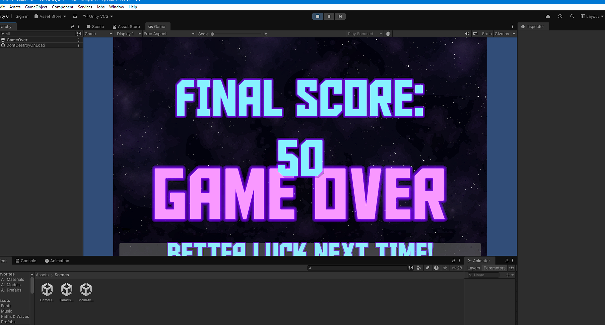
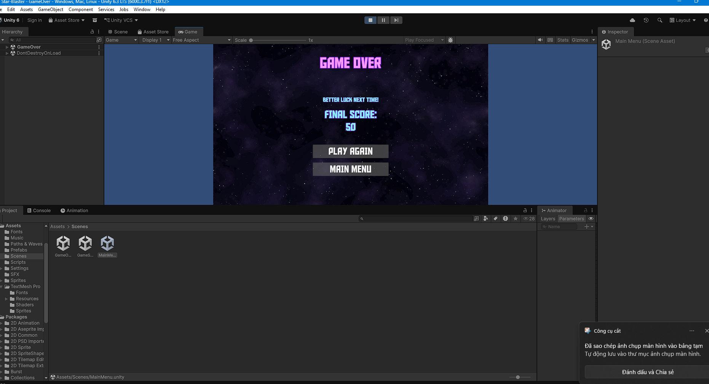

# Lab 03 - Khám phá dự án Star-Blaster

## ## Thông tin sinh viên
- **Họ tên**: Nguyễn Thị Trường Nga
- **MSSV**: 2312697
- **Lớp**: CTK47A

## ## Mô tả
Bài thực hành Lab 03 môn **Game 2D Development with Unity**.
Khám phá và phân tích dự án game Star- Blaster

## ## Các thay đổi đã thực hiện
Thực hiện chỉnh sửa giao diện UI Ending ở scene GameOver.

**Giá trị gốc:**

**Giá trị mới:**

## ## Kiến thức đã học được
1. Biết cách clone và mở một dự án Unity từ GitHub.
2. Hiểu cấu trúc thư mục của một dự án Game 2D.
3. Cách chỉnh sửa các thông số trong Canvas của Unity.
4. Cách quản lý phiên bản và commit thay đổi bằng Git.
5. Sử dụng Markdown để viết báo cáo chuyên nghiệp.

